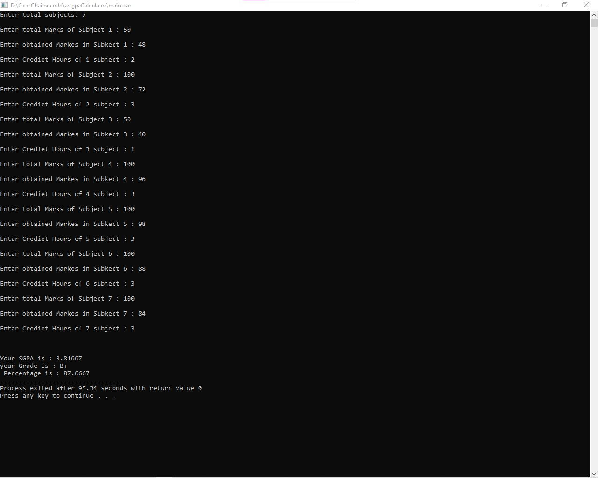
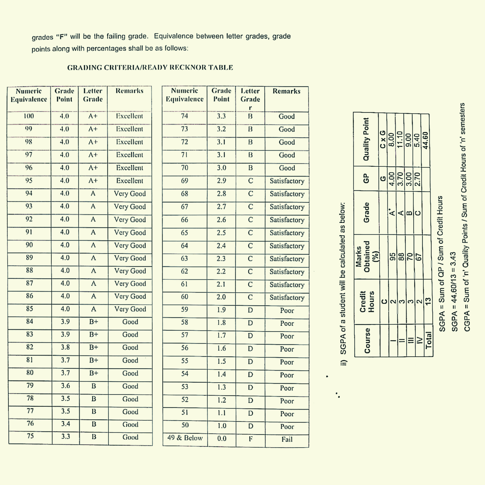

# SGPA_Calculator
A simple C++ GPA Calculator that takes user input for subject marks, calculates the percentage, converts it to GPA, and assigns a grade.
# 🎓 SGPA Calculator – C++ Project  

## 📌 About the Project  
This is a simple **SGPA Calculator** built in **C++**. The program:  
✅ Takes user input for marks in multiple subjects  
✅ Calculates **percentage** and converts it to **GPA**  
✅ Assigns a **grade** based on the GPA  

This project helped me practice **functions, loops, conditionals, and user input handling in C++**.  

---

## 🛠️ Features  
- Supports **multiple subjects**  
- Calculates **percentage and GPA**  
- Assigns a **grade (A, B, C, F, etc.)**  
- Beginner-friendly and easy to understand  

---

## 📥 Installation & Usage  

### **1️⃣ Clone the repository**  

git clone https://github.com/hassanraza105/SGPA_Calculator.git

2️⃣ Compile the program (Using g++ Compiler)

g++ main.cpp -o GPA_Calculator

3️⃣ Run the program

./GPA_Calculator

---
## 📷 Demo (Example Output)  

---
## Grading Policy 

🚀 Contributing

Feel free to fork this repository and improve the project! If you find any issues, open a pull request or an issue.

---
## 📌 Connect with Me  
🔗 [LinkedIn](https://www.linkedin.com/in/muhammad-hassan-raza-274805282)  
🔗 [GitHub](https://github.com/hassanraza105)

